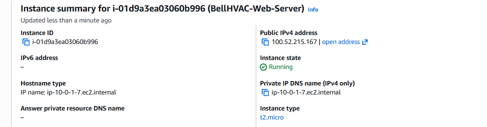
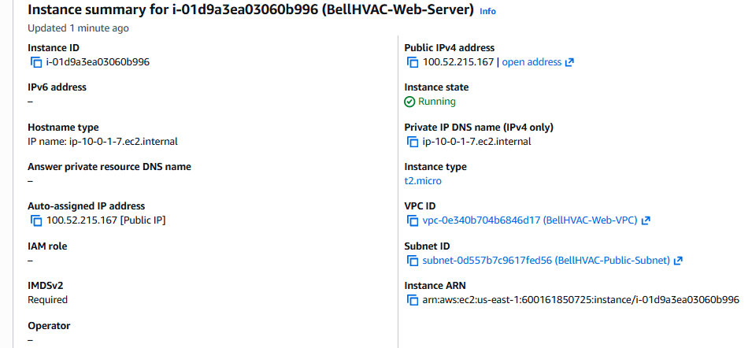
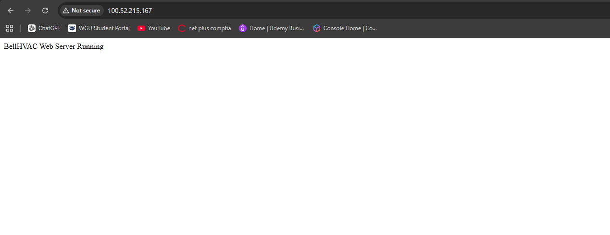

\# AWS Manual VPC + EC2 Web Server Lab


This project demonstrates how to manually deploy a public web server in AWS using core networking components. The infrastructure was created step-by-step through the AWS Console to understand how networking, security groups, and EC2 instances interact.


\---


\## Architecture Overview


The environment includes:


• A custom VPC  

• A public subnet  

• An internet gateway  

• A security group allowing HTTP and SSH  

• An EC2 instance running Amazon Linux  

• Apache web server installed and serving a test page  


This setup allows internet users to reach the EC2 instance through its public IP address.


\---


\## AWS Services Used


\- Amazon VPC (Virtual Private Cloud)

\- Amazon EC2 (Elastic Compute Cloud)

\- Internet Gateway

\- Security Groups

\- Amazon Linux 2023 AMI


\---


\## Deployment Steps


\### 1. Create VPC


A custom VPC was created with the CIDR block:


```

10.0.0.0/16

```


This network provides private addressing for resources within the environment.


\---


\### 2. Create Public Subnet


A public subnet was created inside the VPC:


```

10.0.1.0/24

```


The subnet allows instances to receive public IP addresses.


\---


\### 3. Attach Internet Gateway


An Internet Gateway was attached to the VPC so resources in the subnet could reach the internet.


Route table configuration allowed outbound internet traffic.


\---


\### 4. Configure Security Group


A security group was created to control traffic to the instance.


Inbound Rules:


SSH  

```

Port: 22

Source: My IP

```


HTTP  

```

Port: 80

Source: 0.0.0.0/0

```


This allows SSH administration and public web access.


\---


\### 5. Launch EC2 Instance


Instance configuration:


Instance Type

```

t2.micro

```


AMI

```

Amazon Linux 2023

```


Key Pair

```

BellHVAC-Key.pem

```


The instance was deployed into the public subnet.


\---


\### 6. Install Apache Web Server


After connecting to the instance, Apache was installed and started.


Commands executed on the server:


```

sudo yum update -y

sudo yum install httpd -y

sudo systemctl start httpd

sudo systemctl enable httpd

```


\---


\## Testing the Web Server


The web server was verified by opening the instance's public IP address in a browser:


```

http://100.52.215.167

```


The default Apache test page confirmed the server was reachable from the internet.


---


## Screenshots


### EC2 Instance Launched





### Instance Running





### Web Server Running





---


## Outcome


This lab demonstrates the complete process of manually deploying a public web server within AWS using core networking components.


Skills demonstrated:


\- VPC networking fundamentals

\- Subnet design

\- Internet gateway configuration

\- Security group management

\- EC2 instance deployment

\- Linux server administration

\- Web server deployment

\- GitHub project documentation


\---


\## Author


Anthony Bell  

Cloud \& Network Engineering Student  

Western Governors University

